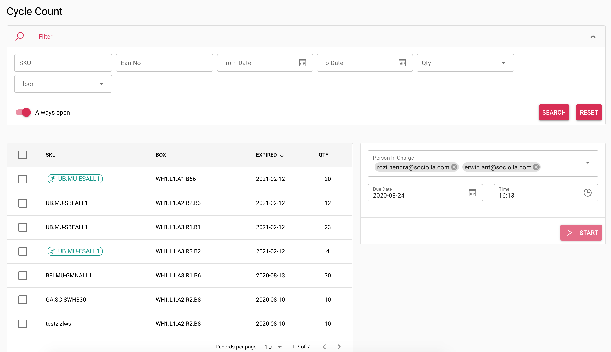

# Create Cycle Count

A cycle count is an inventory auditing procedure, which falls under inventory management, where a small subset of inventory, in a specific location, is counted on a specified day.
This activity is one means of achieving and sustaining high degrees of accuracy.

Working instructions:
* Choose product wisely
* Tick checkbox and start for processing data.

!> Order / Intra transfer cannot be processed during cycle count for related product
!> Person In Charge only listing `picker` user who's already logged in at the day

