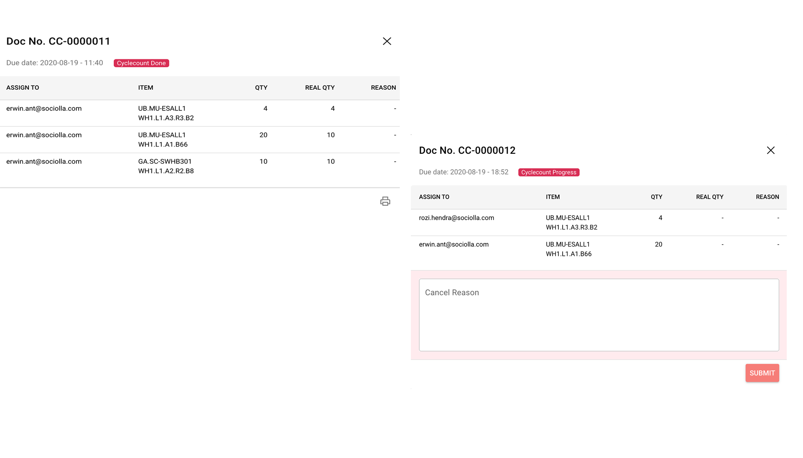

# Monitoring Cycle Count

By creating cycle count task, user also can monitoring task activity using this interface. Each order will be assigned to one picker randomly and grouped as 1 cycle count task with preffix CC document number. Also displayed circular progress to counting remaining task undone.
Click "More" on right table to show detail task

!> print result button will appear when all tasks are done.

Information of dialog:
* Person in charge (email)
* System quantity and real quantity
* Reason if any

> This operation is possible to be cancel for emergency purpose by clicking cancel and fill cancellation reason

