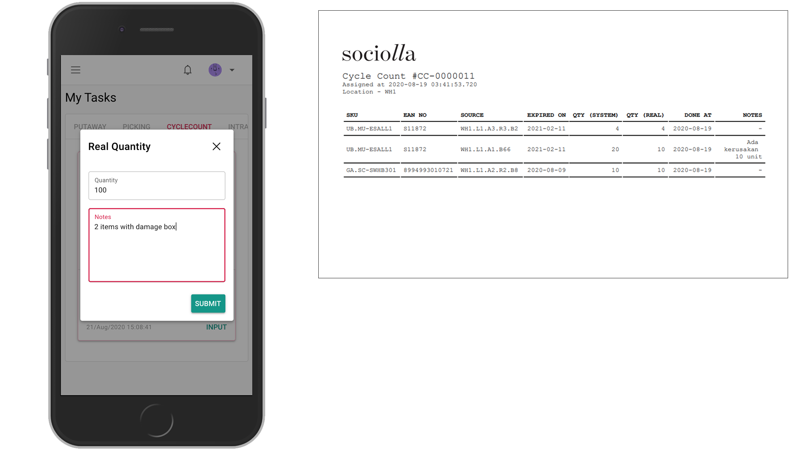

# Task Cycle Count

Task will generate from cycle count creation and by default assigned randomly to each picker. To find task, just click `My Tasks` on left menu. Please notice that task only appear for a related user that already assigned.

Working instructions:
* Click start on card (System will record starting time, click button wisely or if you are ready for the task). Status will change to `In progress`
* Click input and dialog will show up

* On reality, user will go to box
* When arrived on the destination, user counting product and input quantity
* Type any notes if any and submit