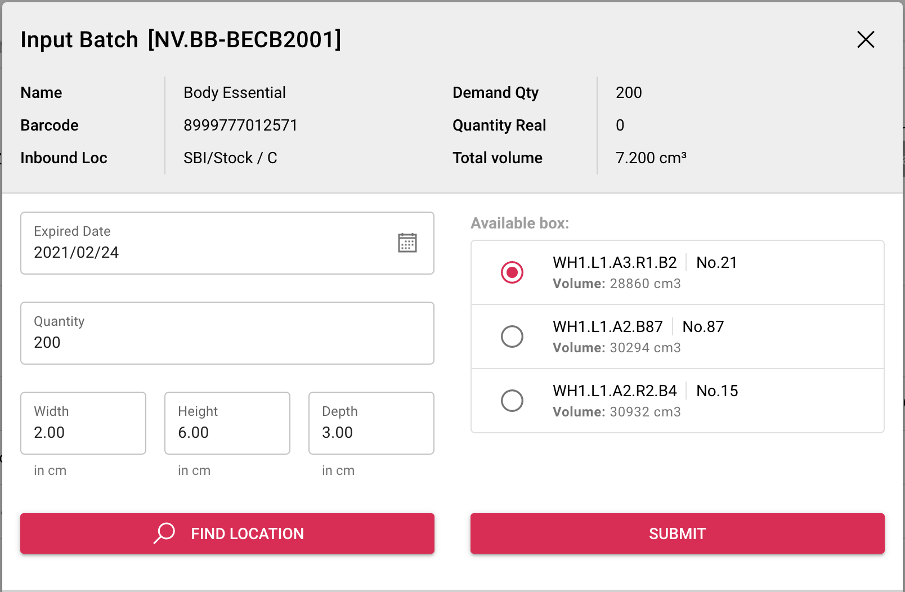

# Inventory Odoo

The App consuming data from odoo ERP, in this case inventory module. As a beginning process, this menu can be accessed by inbound user, manager, and superadmin.
While physic of goods are received, user must fill the initial information about goods (dimension). This is required to calculating volume for box suggestion.

Working instructions:
* Click More button on right on table for the related data
* Click `Set temp location` for placing temporary inbound
* Click `show` to process putaway (it will show Purchase document with products)
* Input detail product by click `input` button.
* Fill expired data, dimension, and qty that you want process. It is possible to set quantity below total quantity to separate box purpose.
* Click find location to get box suggestion
* Click submit, system automatically create putaway task (Check on My Task / Dashboard)

!> By the standart operation process, each product with different expired date will be placed in a separate box.

* By finishing all products, button validate will appear on top right, just click it to validate all quantity. It is possible to accept below quantity but forbidden if over.