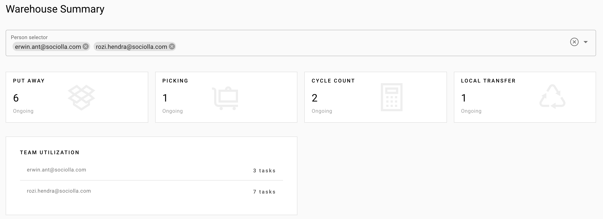

# Inventory Odoo

By default, WMS will show dashboard after logged in which is summary for all `active tasks` in team. Active tasks are `assigned` or `inprogress`.

Each card is clickable, and it will showing detail data as a pop up

> 