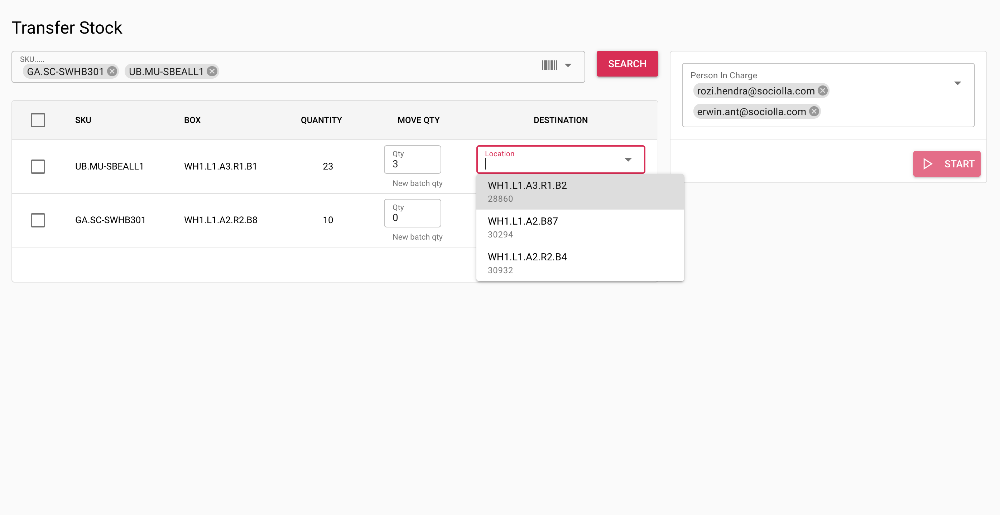

# Create Intra Transfer

Create intra transfer to move product from box to another box in same warehouse.

Working instructions:
* Input product (SKU, ean, or name) which want to move, you can input more than one product
* Click `search` button, table will show listing batch, please choose batch
* Input quantity to move and new destination. Destination will suggested by system
* Click start button for the operation

!> Person In Charge only listing `picker` user who's already logged in at the day

!> Product cannot be appear on search during cycle count still in progress for related product

