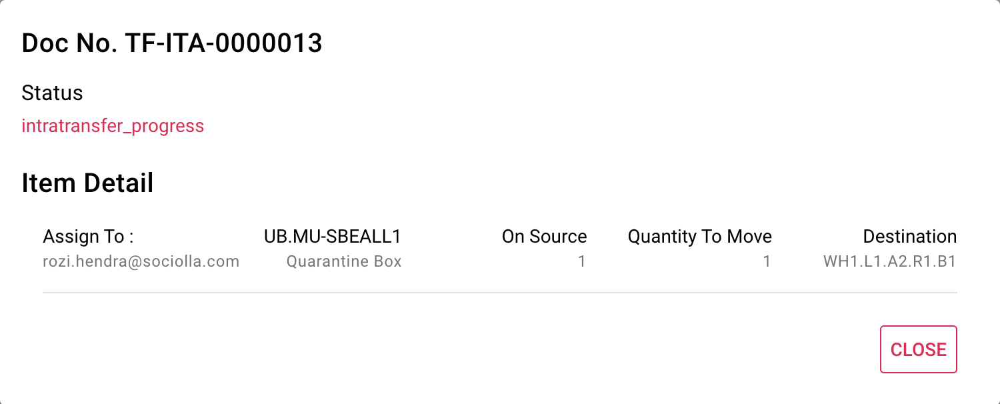

# Monitoring Intra Transfer

By creating intra transfer task, user also can monitoring task activity using this interface. Each order will be assigned to one picker randomly and grouped as 1 intra transfer task with preffix TF-ITA document number. Also displayed circular progress to counting remaining task undone.
Click "More" on right table to show detail task

!> print result button will appear when all tasks are done.

Information of dialog:
* Person in charge (email)
* Quantity current and move quantity
* Current location and new destination location

