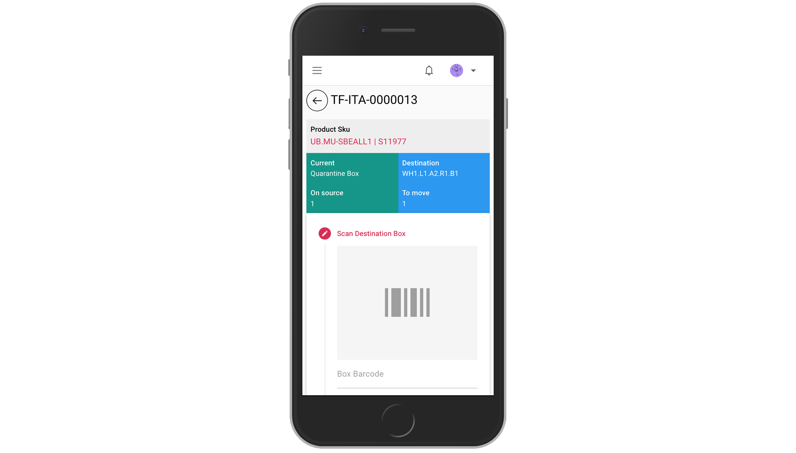

# Task Intra Transfer

Task will generate from intra transfer creation and by default assigned randomly to each picker. To find task, just click `My Tasks` on left menu. Please notice that task only appear for a related user that already assigned.

Working instructions:
* Click start on card (System will record starting time, click button wisely or if you are ready for the task). Status will change to `In progress`
* Click card, and click right arrow to process task



* On reality, user will go to box
* When arrived on the destination, user
````` scan box barcode`````, then ````` scan product ean no`````, and input quantity
* Type any notes if any and submit

!> As long as input doesn't match requirement, task cannot be finish