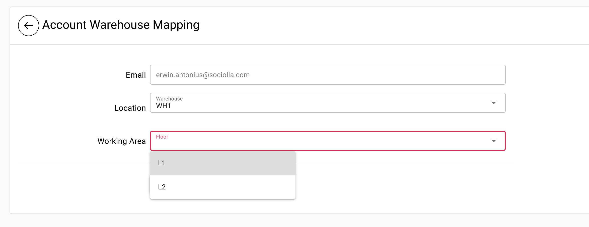

# Maintain User

WMS only consume user email and role from SOCO Authentication, for detail user please refer to https://soco.id profile.
These master menu use for assigning warehouse and working area (WMS Users)

For example, editing user is as follows:
* Click Master -> User on left menu
* Click edit on right column in table for related user
* Select warehouse, working area (floor), and save
> 

!> Privilege Menu for superadmin
