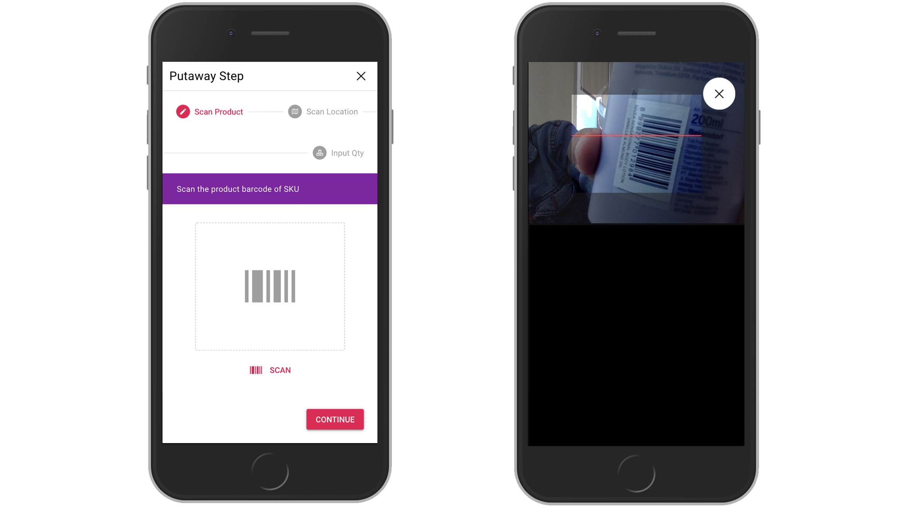

# Putaway

Putaway task generated by inbound process and assigned to putaway user for placing product to box. To find task, just click `My Tasks` on left menu. Please notice that task only appear for a related user that already assigned.

Working instructions:
* Click start on card (System will record starting time, click button wisely or if you are ready for the task). Status will change to `In progress`
* Click card, and click right arrow to process task


* On reality, user will go to box with product in hand
* When arrived on the destination, user
````` scan product ean_no`````, then ````` scan box barcode`````, and input quantity
* This task finish if above activity has achieved.


