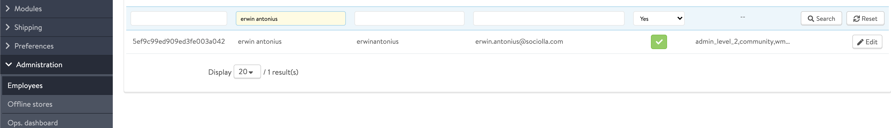
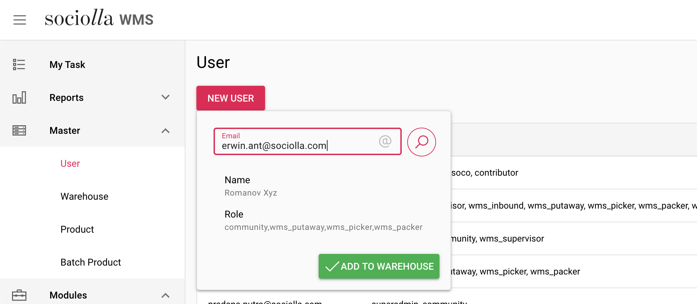
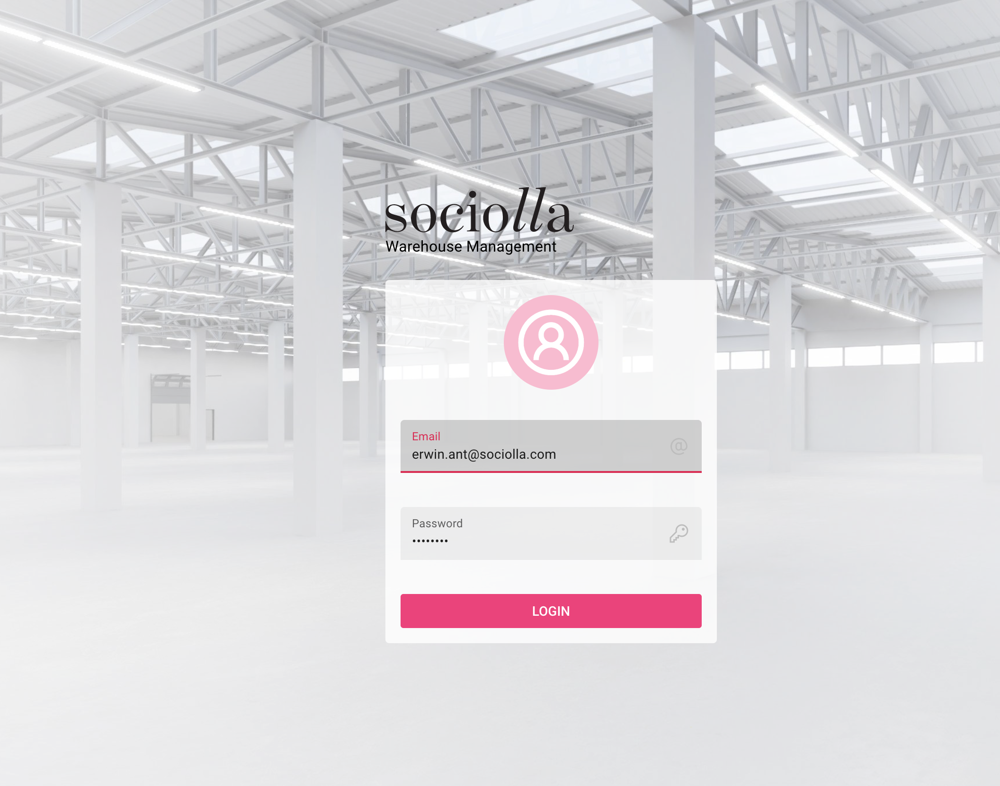
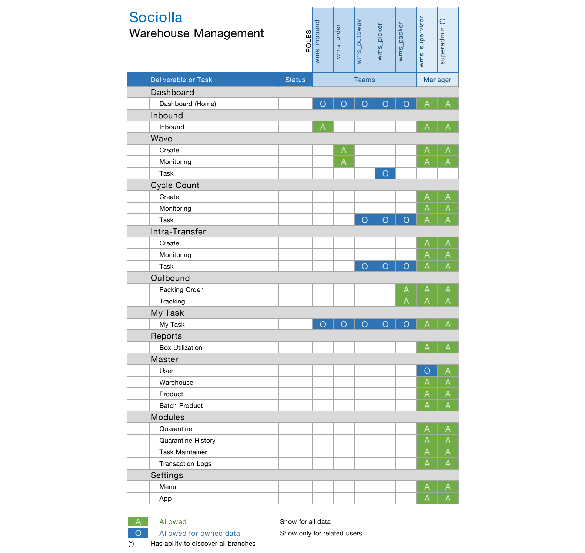

# Create User

> Go to https://soco.id

Click "Daftar" on top corner, and straight follow the instructions

Tips :
* Choose `username` wisely for business purpose
* Use `email` by sociolla mail business

## Assigning Role

After soco registration, please contact sociolla `admin panel` for role assignment.

On admin panel, go to Administration -> Employee, search for target user and click edit for related user.

?>

Select role which has preffix `wms_`

?>

## Mapping to WMS

> Go to https://wms.sociolla.xyz using administrator privilege

* On left menu, expand `Master` and click `User`

* Click `New user`, enter email for related user, and `Add To Warehouse`

?>

## Login WMS

> Go to https://wms.sociolla.xyz, log in by user account was created before

## Role Matrix

