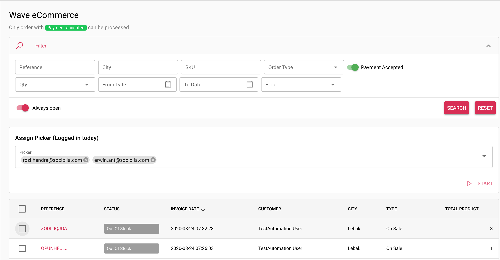

# Create Wave

The App consuming data from Friday (Sociolla Admin Panel), in this case `order` module. This menu can be accessed by order user, manager, and superadmin.
App only get Order with status `Payment Accepted` and `Delivery Slip Printed`, and by default system filtering only `Payment Accepted` to be processed.
Order cannot be process in following conditions:
* Product not available
* Product on progress cycle count
* These conditions also applied for multiple product order

Working instructions:
* Create wave wisely by filtering order data
* Filtering by Floor (Location) will fetch the Order data with `some products` that available on related floor
* Tick checkbox and start for processing data.

!> Person In Charge only listing `picker` user who's already logged in at the day

> To show detail Order Product, just click `order reference code`