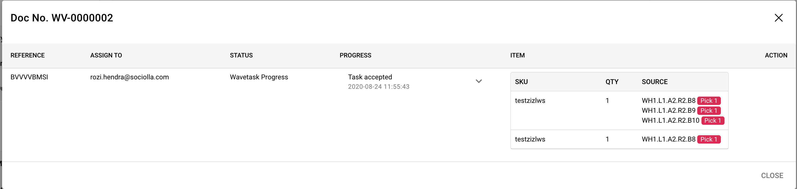

# Monitoring Wave

By creating wave task, user also can monitoring task activity using this interface. Each order will be assigned to one picker randomly and grouped as 1 wave task with preffix WV document number. Also displayed circular progress to counting remaining task undone.
User can tracking picker progress by click "Magnify" icon on right table, and dialog will show.

Information of dialog:
* Person in charge (email)
* Progress with detail status from task accepted until task finished
* Suggestion box picker

!> User can print each task by clicking `Print` button (Thermal Printing required)

