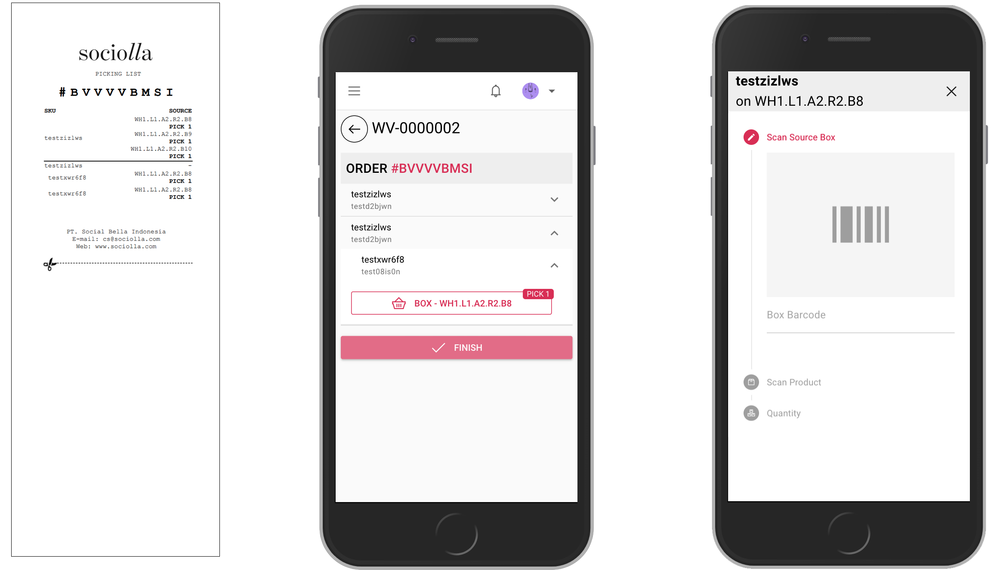

# Task Wave

Task will generate from wave creation and by default assigned randomly to each picker. To find task, just click `My Tasks` on left menu. Please notice that task only appear for a related user that already assigned.

Working instructions:
* Tap task card
* Click start button on top right interface, (System will record starting time, click button wisely or if you are ready for the task). Status will change to `In progress`



* On reality, user will go to box
* When arrived on the destination, user
````` scan box barcode`````, then ````` scan product ean no`````, and input quantity
* Button finish will enable when all products already picked.